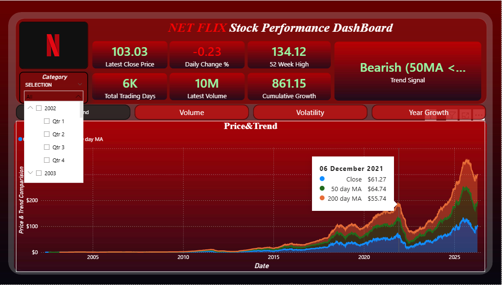
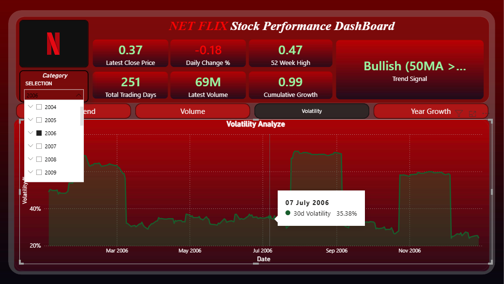
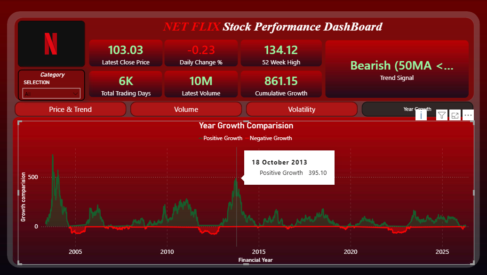

# Netflix Stock Performance Analytics Dashboard

## Project Overview

An interactive Power BI dashboard developed to analyze Netflix stock
performance and historical stock market trends.

## Tools Used

- Power BI
- Power Query
- DAX
- Excel / CSV
- Data Visualization

## Dashboard Features

KPI CARDS:
- Latest Close Price
- Total Trading Days
- Daily Changes %
- Latest Volume
- 52 Week High
- Cumulative Growth
- Trend Signal
- Slicers by Year & Quarter

Dashboard Visualizations:
- Price And Trend Analysis
- Volume Analysis
- Volatility Analysis
- Year Growth Analysis

## Objective

The objective of this project is to transform Netflix stock market
data into meaningful insights using Power BI.

## Project File

The Power BI `.pbix` file is available in this repository.

## Author

Yogesh Kumar.K

B.Sc Computer Science with Data Analytics

## 📸 Dashboard Preview

### Dashboard 1

### Dashboard 2

### Dashboard 3

